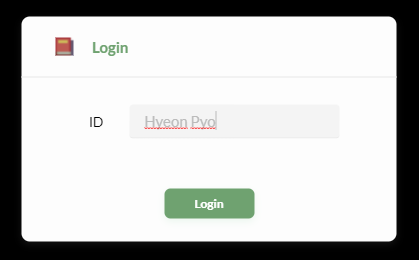

# study-street

## study-street

Documents and Codes for https://study-street-client.herokuapp.com/, course project, KAIST CS473 Introduction to Social Computing 2021 Fall 

## Getting started to develop
### Dependencies
- Node v14
- Browser: Chrome
### Install
- Server
    - At the root directory
    - `cd server`
    - `npm install`
- Client
    - At the root directory
    - `cd client`
    - `npm install`
### Run

In development environment, study-street uses `concurrently` to run two servers simultaneously.  
- At the project root directory, do
- `cd server`
- `npm run dev`
### Used libraries

There are three main libaries.
- React: React is used for ui components and managing data
- Phaser: Phaser is a javascript-based 2d game library. It is used for our virtual space shared by multiple users.
- socket.io: socket.io is a library that supports a continuous and low-latency connection with clients and the server. It is used for all client-server communication, as well as for sharing states of virtual space.

### Files and folder structure
#### Criteria for choosing

- Too many new technologies will make development hard. Do not be too much. 
- Choose a version with which each library can be integrated easily and enough supports from documents and commmunity exist.  
- Modularize program so that each module is simple enough. It will make cowork easier. Let modules have high cohesion and low coupling.
#### Structure

- client
    - src
        - components
            - Game ← A folder for Phaser scripts
                - entity
                    - Phaser entities (js files)  
                - scenes
                    - Phaser scenes (js files)    
                - `index.js` ← Phaser base, as a React component                    
            - request
                - React helper functions for server request. For more info, refer [client/src/components/request/README.md]
            - ui
                - React components. To explorer these components, start from [client/src/App.js].                
        - `index.js` ← The initially executed script.
        - `App.css` ← A stylesheet for App.js.
        - `App.js` ← The base react component which is a parent for all other components.
        - `socket.js` ← Singleton socket.io client instance.
            
    - public ← static files
        - assets ← Phaser assets                
            - images
                - `Image files`
            - spriteSheets
                - `Image files for animation`
            - map
                - `Image files for map` ← Tilemaps are used
        - `*-icon-*.png` ← Site icons
        - `index.html` ← Base HTML file
- server
    - `app.js` ← The initially executed script script of server. It initialize a new SocketIOServer instance.
    - `socketIOServer.js` ← The base script for all socket io communication. It directly handles requests for virtual space and chat. 
    - `requestHandle.js` ← This script handles most requests that do not require strict real time communication. Requests handled by this script is defined in [requestType.js]. For more information, refer [client/src/components/request/README.md].
    - `requestType.js` ← Most constants for request and response are defined here.
    - `room.js` ← A class for users and their positions in each scene.
    - `database.js` ← A database. Currently, we do not use a persistent database. The database is stored in RAM through this file.
  
## How to login

Type in your ID and click "Login". 

> Please DO NOT use enter key throughout our app. It would reload the whole session.

<figcaption align="center">Study-Street : Type in your campuswire name including whitespace and click green Login button. (*DO NOT press enter Key)</figcaption>

### Prepared ID list
We do not have sign up functionality yet. Hence, we prepared accounts for each instructor and students of 2021 Fall CS473 Social Computing class.
 
Login ID is your **full name registered in campuswire**  [CS473 2021 Fall].

Please use exactly same name **including whitespace** between first and last name. We recommend to use Crtl+C Ctrl+V.

You can check your name by clicking on the profile image on left below of the page.

<figcaption align="center">In Campuswire web, click profile image on left below to see your full name (Hyeon Pyo)</figcaption>

 

<figcaption align="center">In Campuswire app, tap settings on the rightmost to see your full name (Hyeon Pyo)</figcaption>

#### Guest ID

> `guest`

"guest" (without quote mark and whitespace) is the guest id for spare.

Use guest id only for brief explorations or tests. Please ask for new login id to experience whole features. Guest id is shared and app would terminate when another uses it. 

## How to explore Study Street
This guideline is made to support your end-to-end scenario. For detailed information, you may refer to the instruction(Welcome!) and feature parts written in the High-Fi Prototype Report.

- First, to access to our server, login to the main by using your Campuswire account. For detailed instruction, refer to ‘How to login’ in the README.md.
- Before you enter the library, you can view your name, profile image, and status. You can also invite others, or check the invitation from friends by entering the group page on the left side bar.
- You can enter to the library by clicking the door button written in ‘Walk to the library’. Then, you can control your avatar by using the direction key in the keyboard.
- When you are in the library / rest scene, these are the things you can explore.
    - Status of other users and group area (group area for library scene): The desk and bookshelf are assigned when your group is made. You can study with your group members at the located group area. Also, you can see what others are doing by hovering the mouse at other users’ avatar. You can start studying and move to study scene by clicking the chair.
    - Chatting with other friends: Press the member icon with circled shape on the left side. Then, you can send private messages to other group members. This is also available in the rest scene.
    - Checklist and artifact (artifact for library scene): Press the second button at the bottom. Then, you can view your daily checklist and group quests. In each of the taps, you can add your personal to-dos and share group quests with other members. To look for the artifacts that you received after you accomplished your group quest, click the red books in the bookshelf located at your group area.
    - Go to Rest / Return to Study: When you want to take a rest or restart studying, you can move by pressing the button ‘Go to Rest’ and ‘Return to Study’, respectively.
- When you are in the study scene, these are the things you can explore.
    - Checklist: This is the same as the one you see in the study scene.
    - Stickies: You can still chat with other friends. But, to concentrate on your study, the stickies asynchronously show the messages in constant period. You can reply to the friends after you check it, but they aren’t delivered to others immediately either.
    - Date and Stopwatch: You can check the date and the amount of time you studied.

## CONTACT

Please let us know if you any problem with our app, including logins.

megatwins@kaist.ac.kr (Hyeon Pyo)

campuswire [CS473 2021 Fall] post or dm @Hyeon Pyo

 

## Cautions and Limitations

- Browser Issue

    You must use **Chrome browser** to open our app. It would be safer if your Chrome browser is latest version. If not, our app may not be operated and styled in the same way we intended or even not work at all.

- Hosting Server Issue

    We are deploying our app using **Heroku**'s server which is very fine except for some fatal flaws. 
    
    (1) It refreshes its server once for everyday. As a result of refreshing, since we do not still have external database connected, your **data would be lost after a day** and cleared to the restored to its initial state. 

    (2) As the limit of the quality of Heroku's server, our app may not be able to hold a lot of users simultaneously. Loading speed may be slow regarding to the condition of the server.

- Refresh Issue

    Since we do not save any cache data, you will be logged out when you refresh the app. So, we recommend you to **avoid refreshing** while experiencing our app. As a trick, you can refresh in order to log out.

- Responsibility Issue 
    
    Since some components consisting our app is not supporting responsibility due to the various screen size, we recommend you to use the app in **desktop or laptop** environment instead of using external monitor or mobile devices. Even if you are using our app with laptop, few components can be overlapped.
